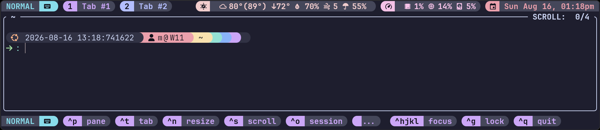

# zjstatus-hints

A [Zellij](https://github.com/zellij-org/zellij) plugin that displays context-aware key bindings for the current mode, styled and configured to match the rest of your status bar. It runs standalone in its own pane, or pipes its output into [zjstatus](https://github.com/dj95/zjstatus) for setups that already use it. See [Installation](#installation).

> [!NOTE]
> This is a fork of [b0o/zjstatus-hints](https://github.com/b0o/zjstatus-hints) by Maddison Cohodas. The original shows a curated set of hints piped to zjstatus. This fork keeps that, adds a standalone mode that needs no zjstatus at all, and builds a configuration layer on top of both. See [What this fork adds](#what-this-fork-adds).



<!-- GitHub only renders an attachment as an inline video from a bare URL. -->
<!-- markdownlint-disable-next-line MD034 -->
https://github.com/user-attachments/assets/940a31a0-86de-469d-89e2-dab18a1aaca8

## Rationale

Zellij's built-in status bar shows keybinding hints for your current mode, but you lose them the moment you replace it with something else. This plugin restores that functionality as its own independent piece: run it in its own pane for a drop-in replacement, or, if you already run [zjstatus](https://github.com/dj95/zjstatus), pipe the hints into it instead of standing up a separate pane.

## What this fork adds

The original shows a [curated list](docs/hints.md#the-curated-list) of hints and pipes it to zjstatus, with four configuration options. This fork keeps that behavior and builds a configuration layer over it:

- [Standing alone](docs/nested-sessions.md#standing-alone): run in its own pane, with the current mode prefixed onto the line, no zjstatus required
- [Styling](docs/styling.md): global and per-hint format strings, colors, and key and modifier aliases, so `Ctrl Left` can read `^←`
- [Discovery](docs/hints.md#discovered-hints): optionally surface every keybinding your config enables, not just the curated set
- [Labels](docs/labels.md): rename, hide, merge, or reorder any hint, globally or in a single mode
- [Ordering](docs/ordering.md): keyboard-layout-aware key order, and a pinned order for the hints themselves
- [Fitting](docs/fitting.md): drop whole hints to fit the terminal as it narrows, in an order you choose, with an optional indicator for what was cut
- [Nested sessions](docs/nested-sessions.md): show the hints of the nested session the keys are actually going to, and hide or dim this session's own while it is not the one receiving input, so a host and a nested session sharing one layout do not end up with doubled chrome, giving the layout row back rather than leaving a blank line behind
- Zellij 0.46 support

Four options upstream, around two dozen here. The full list is in the [configuration reference](docs/configuration.md).

## Placeholders

Some option names and tag names below are families rather than fixed strings. Each family's variable part is written in angle brackets.

| Placeholder | You replace it with |
| --- | --- |
| `<mode>` | A lowercased Zellij mode name, giving `mode_format_locked` |
| `<name>` | An alias name you choose, giving `color_blue` |
| `<line>` | A Zellij minor, giving the tag `zellij-0.46` |
| `<label>` | An EA channel name, giving the tag `ea-nested-sessions` |

## Installation

Add zjstatus-hints to your Zellij configuration and give it a pane of its own; no zjstatus required. See [Displaying the hints](#displaying-the-hints) below to pipe it into zjstatus instead.

```kdl
plugins {
    zjstatus-hints location="https://github.com/myah-mitchell/zjstatus-hints/releases/latest/download/zjstatus-hints.wasm" {
        // Hard cap on the width of the hint line, in columns
        max_length 0 // 0 = unlimited
        // Fit the hints to the terminal, dropping trailing hints as it
        // narrows. Reserve columns for whatever shares the bar.
        auto_width true // default
        reserve_columns 0 // default
        // Set to 2 if your terminal draws Nerd Font glyphs double-width.
        ambiguous_width 1 // default
        // Appended when a single hint is too wide to fit even alone
        overflow_str "..." // default
        // Name of the pipe for zjstatus integration
        pipe_name "zjstatus_hints" // default
        // Hide hints in base mode (a.k.a. default mode)
        // E.g. if you have set default_mode to "locked", then
        // you can hide hints in the locked mode by setting this to true
        hide_in_base_mode false // default

        // Render nothing while this session is nested inside another, so
        // one shared layout can serve both. See docs/nested-sessions.md.
        hide_when_nested true // default
        // Hand this plugin's layout row back to the panes around it while
        // the bar has nothing to draw, rather than leaving a blank line.
        // See docs/nested-sessions.md#giving-the-row-back.
        collapse_when_empty true // default
        // Dim hints while this session isn't the one receiving input.
        dim_when_unfocused true // default
        dim_strength       "0.5" // default, 0.0-1.0 (quoted: Zellij's plugin-config
                                 // parser only accepts strings, ints, and bools for a
                                 // node value, so a bare decimal like 0.5 fails to load)

        // Prefix the hints line with the current mode. Useful when this
        // plugin runs in its own pane rather than piped into zjstatus's
        // {mode} widget. mode_format_<mode> (e.g. mode_format_normal) gives
        // a single mode its own icon, the same as zjstatus's mode_normal.
        // See docs/nested-sessions.md#standing-alone.
        show_mode true // default false

        // Also show every other keybinding your config enables, beyond the
        // curated list. See docs/hints.md.
        discover_hints true // default false
        // Hide bindings that every mode inherits from the base mode, so each
        // mode only advertises what is new in it. See docs/hints.md.
        hide_shared_hints true // default
        // When a hint is bound to both hjkl and the arrows, show only one
        // family: "both" (default), "arrows", or "letters".
        direction_keys "both" // default
        // How keys within a hint are ordered: a keyboard layout
        // ("qwerty", "dvorak", "colemak"), "abcdef", or "none".
        key_order "qwerty" // default
        // Pin hints to the start or end of each mode; "*" is everything
        // else. Unset leaves the order each mode builds.
        hint_order "*, exit"
        // Override or hide any hint's label by its concept id; an empty
        // value hides it. See docs/labels.md for the full list of ids.
        label_mode_locked "lock"
        label_split_down  "split ↓"

        // Optionally style the hints using zjstatus-style format strings.
        // When unset, the current Zellij theme palette is used automatically.
        // `{key}` and `{desc}` are replaced with the keybinding and its label.
        // See docs/styling.md for the full syntax.
        key_format  "#[fg=$black,bg=$blue,bold] {key} "
        desc_format "#[fg=$fg,bg=$bg] {desc} "
        // Drawn between hints (never before the first or after the last).
        // Also a format string, so it can be a styled glyph, not just space.
        hint_spacer "#[fg=$fg] │ "
        // Shown where hints were dropped because the window is too narrow.
        drop_indicator "#[fg=$fg]…"
        // Which pinned group outlives the other: "tl" or "lt".
        hint_precedence "tl" // default

        // `$name` colors resolve to the matching `color_<name>` option, exactly
        // like zjstatus color aliases.
        color_black "#1e1e2e"
        color_blue  "#89b4fa"
        color_fg    "#cdd6f4"
        color_bg    "#313244"

        // Optionally replace key names with symbols, e.g. show ENTER as ↵.
        // Uses the same per-line alias pattern (see docs/styling.md).
        key_alias_enter "↵"
        key_alias_space "␣"
        key_alias_esc   "⎋"

        // Likewise for modifiers: show Ctrl as ^ and Alt as ⌥.
        mod_alias_ctrl "^"
        mod_alias_alt  "⌥"

        // Collapse a custom leader key's full modifier chord to one symbol
        // (see docs/styling.md#chord-aliases).
        chord_mods_leader  "ctrl+alt+super+shift"
        chord_alias_leader "&"
    }
}

layout {
    default_tab_template {
        children
        pane size=1 borderless=true {
            plugin location="zjstatus-hints" {
                show_mode true
            }
        }
    }
}
```

### Release channels

Four channels are published:

| Channel | Contents |
| --- | --- |
| `latest` | Tagged releases. What the URL above resolves to. |
| `nightly` | Rebuilt from `main` every night, tests green. Prerelease. |
| `zellij-<line>` | The newest release built for a given Zellij minor, e.g. `zellij-0.44`. |
| `ea-<label>` | An on-demand build of any ref, published on request. Prerelease; see [docs/automation.md](docs/automation.md#eabeta-releases). |

Zellij caches remote plugins by URL, so pointing the config at the nightly URL will keep serving whatever it downloaded first. To track nightlies, fetch into the plugin path instead and start a new session:

```bash
make nightly   # or: make latest
```

#### Matching your Zellij version

`latest` is not always built for the Zellij you run: this plugin's own version and the Zellij it targets move independently (see [Versioning](#versioning) below). Mixing them is silent, not a build error: Zellij's plugin boundary decodes a binding's actions with `.filter_map(|a| a.try_into().ok())`, so an action a mismatched plugin does not recognize is just dropped, and hints render with the wrong label rather than failing to load.

Check what your build targets, or fetch one for the Zellij you actually run:

```bash
zellij --version                 # e.g. 0.44.3
make zellij VERSION=0.44         # newest release built for that line
```

`zellij-<line>` always resolves to the newest zjstatus-hints release built for that Zellij minor, however many versions have shipped since (the same moving-pointer pattern as `latest` and `nightly`, just scoped to one Zellij line instead of to everything).

### Versioning

Most releases are patch bumps on this fork's own schedule, unrelated to when Zellij releases. A minor version bump marks one of two things: a move to a new Zellij minor, or added functionality. A plain bugfix release is therefore never mistaken for either.

| `zjstatus-hints` | Targets Zellij |
| --- | --- |
| 0.3.x | 0.44.x |
| 0.4.x | 0.45.x |
| 0.5.x (current release) | 0.46.x |

A new row means the Zellij line moved. The reverse does not hold: a minor bump that added functionality keeps the same target, so it extends the row it is on rather than starting a new one. Work that needs a newer Zellij never lands on the line below it, which is why 0.46 support is 0.5.x rather than a later 0.4.x.

Bumping past a Zellij minor is deliberately not automatic, and the previous line's last compatible release stays reachable forever at its own `zellij-<line>` tag. See [docs/automation.md](docs/automation.md) for why and how that update is proposed instead of applied.

### Displaying the hints

Wire the plugin into your default layout (`layouts/default.kdl`) either of two ways. Both read the same configuration above.

#### Option A: its own pane

This is what the installation example above already does: give the plugin a pane of its own, referencing the `zjstatus-hints` alias defined in the `plugins {}` block. Set `show_mode true` so the line still carries the current mode, the way `{mode}` would in zjstatus. See [Standing alone](docs/nested-sessions.md#standing-alone) for styling the mode prefix, and note that a pane-based plugin (unlike one loaded headless via `load_plugins`) is what lets [nested-session](docs/nested-sessions.md) hiding and dimming work at all.

#### Option B: piped into zjstatus

If you already run [zjstatus](https://github.com/dj95/zjstatus), pipe the hints into its bar instead of giving zjstatus-hints a pane of its own. Two changes from the layout above:

1. Replace the `pane { plugin location="zjstatus-hints" { ... } }` block with a headless load, since a piped plugin draws nothing of its own:

   ```kdl
   load_plugins {
       zjstatus-hints
   }
   ```

2. Add `{pipe_zjstatus_hints}` to whichever of zjstatus's own format options should carry the hints: `format_left`, `format_center` or `format_right`. The placeholder name follows `pipe_name`, which defaults to `zjstatus_hints`. Then set `pipe_zjstatus_hints_format "{output}"`; without it, zjstatus won't render the pipe at all:

   ```kdl
   pane size=1 borderless=true {
       plugin location="zjstatus" {
           format_left  "{mode} {tabs}"
           format_right "{pipe_zjstatus_hints}{datetime} "

           pipe_zjstatus_hints_format "{output}"
       }
   }
   ```

`show_mode` and `mode_format` are unnecessary here, since zjstatus's own `{mode}` widget already covers that.

## Configuration

The plugin works with no configuration, so this section is only for changing something. Every option and its default is in the [configuration reference](docs/configuration.md), and the detail behind each group lives in its own page:

| Topic | What it covers |
| --- | --- |
| [Styling](docs/styling.md) | Format strings, colors, per-hint styling, key and modifier aliases |
| [Keys and ordering](docs/ordering.md) | Which keys show for a hint, and the order of keys and of hints |
| [Fitting the bar](docs/fitting.md) | Fitting to the terminal, dropping hints, the drop indicator |
| [Hints](docs/hints.md) | The curated list, discovery, and shared bindings |
| [Labels](docs/labels.md) | Renaming, hiding, merging, and per-mode labels |
| [Nested sessions](docs/nested-sessions.md) | Hiding, dimming, and running the plugin in its own pane |

Every page in `docs/` is listed in the [documentation overview](docs/overview.md).

For how the repository builds, tests and releases itself, see [docs/automation.md](docs/automation.md).

## Known issues

Five RUSTSEC advisories are open against the dependency tree. All are warning-level, covering unmaintained or unsound crates rather than vulnerabilities, and none is reachable in the wasm plugin that actually ships. `cargo audit` passes because these are warnings.

| Advisory | Crate | Reaches this project via |
| --- | --- | --- |
| RUSTSEC-2021-0139 | `ansi_term` | `zellij-tile-utils` |
| RUSTSEC-2021-0145, RUSTSEC-2024-0375 | `atty` | `clap 3` and `clap_derive` in `zellij-utils` |
| RUSTSEC-2024-0370 | `proc-macro-error` | `clap 3` and `clap_derive` in `zellij-utils` |
| RUSTSEC-2026-0221 | `event-listener` | `isahc` in `zellij-utils` |

Being a proc-macro crate, proc-macro-error never ships in any compiled output, wasm or host. The `isahc -> curl -> openssl-sys` chain is absent from the `wasm32-wasip1` dependency graph entirely, and appears only on the host target that `cargo test` builds.

None of them can be shed from here. Swapping this project's own ansi_term for nu-ansi-term would only add a second ANSI crate, since zellij-tile-utils still pulls ansi_term in, and the clap 3 and isahc advisories only clear when Zellij itself moves off those crates. Shedding them is a job for a later Zellij.

## Contributing

Issues and pull requests are welcome. See [CONTRIBUTING.md](CONTRIBUTING.md) for the development loop, and [CODE_OF_CONDUCT.md](CODE_OF_CONDUCT.md) for expected conduct. Security problems should go through [SECURITY.md](SECURITY.md) rather than a public issue.

How this repository builds, tests and releases itself is described in [docs/automation.md](docs/automation.md).

## License

&copy; 2026 Myah Mitchell &copy; 2025 Maddison Cohodas

A fork of [zjstatus-hints](https://github.com/b0o/zjstatus-hints) by Maddison Cohodas, itself adapted from the built-in Zellij status-bar plugin by Brooks J Rady.

MIT License
